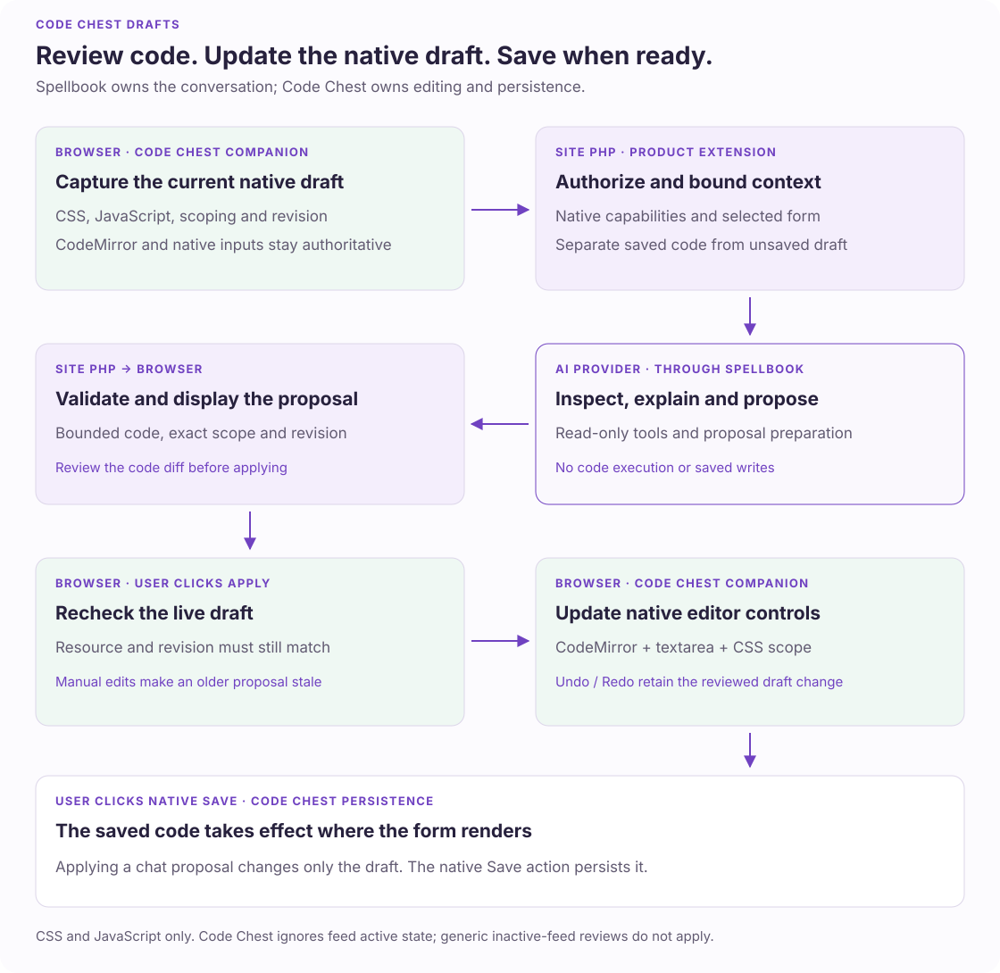

# Review Code Chest changes with Spellbook

Ask Spellbook to style a form or adjust its JavaScript from any supported,
authorized page. Identify the target form if the current page does not supply
one. The assistant reads its code and prepares a diff.

For the form open in **Form Settings → Code Chest**, approval updates the native
editor draft; use **Save Settings** to persist it. For another target form or from
another page, a separate **Save code changes** review persists the exact approved
code through Code Chest.

The integration needs both Spellbook and Code Chest. Installing Code Chest alone
does not register a generic feed-writing adapter.

## Try a focused change

1. Open a form's **Code Chest** settings and open Spellbook.
2. Ask for a change such as “Make the Email label easier to distinguish.”
3. Review the CSS or JavaScript diff and any CSS scoping change. The diff retains
   exact code and trims distant unchanged lines.
4. Click **Apply to code draft**. Code Chest checks the current draft and runs
   available native lint before updating CodeMirror, its backing textareas, and
   the scoping toggle.
5. Inspect the native editors. **Undo** restores the whole suggestion; **Redo**
   reapplies it. **Save Settings** persists this native draft.

The adapter does not execute proposed code or provide an unsaved frontend
preview. Native lint can identify syntax errors; passing lint does not establish
runtime correctness. If lint is unavailable, the card says so. Normal saved
Code Chest scripts and styles apply wherever the form renders.

## Find the code editor

From any assistant page with a current saved form, Code Chest adds an **Open
Code Chest** action that links to that form's code editor. The action needs both
native permissions below and no entry access; a missing or trashed form gets no
action. Code Chest's guidance, in its `includes/spellbook-guidance.json` contract
file, explains saved-code reviews from other pages and unsaved drafts in the
native editor. When the saved-code tools are listed, navigation is optional.

## Follow the ownership boundary

| Owner | Responsibility |
| --- | --- |
| Code Chest PHP companion | Declare the native editor's draft; fingerprint the saved code; list field references; own the separately approved cross-page saved writer and its tools |
| Code Chest browser binding | Read live CodeMirror state; report edits; lint a proposal; write both editors and the scoping toggle together, rolling back a partial write |
| Spellbook | Authorize the form; check the draft against its descriptor; propose and review changes, showing code as a diff; run Apply/Undo/Redo and the revision checks on its draft engine; retain display-only history |
| Native Code Chest settings | Persist mounted drafts through Save Settings, with existing encoding and runtime behavior |

The native editor's draft is a [page descriptor](../../spellbook/docs/assistant-native-settings-drafts.md#draft-a-forms-own-settings)
in Code Chest's `includes/spellbook-settings.json`: `gf-code-chest`, scope `form`,
with the settings `css` and `js` (each `display: 'code'`, at most 8 KiB)
and `scopeCssToForm`, and a 33,024-byte values budget for escaped code. Its resource
key is `gf-code-chest:<formId>`. Spellbook authorizes the form and Code Chest's form
settings capability, prints the configuration on the native Code Chest settings page,
and the browser binding registers through `registerBinding('gf-code-chest', create)`.
Code Chest's `identity` callback fingerprints the saved code the editor opened with,
its `validate` callback holds each language to the 8 KiB its saved code reads back
within, and its `sources` callback lists up to 100 field IDs, labels (admin labels first)
and types. The saved-code tools are Code Chest's own `gf-code-chest-saved` extension,
including tools for other target forms while that native editor is open.

## Understand what the assistant receives

The draft's context is the editor's current code and scoping. Its inspect tool adds
the schema and the field references; there are no entries or other forms' code.

The page also carries an identity: a fingerprint of the saved code it opened
with. If code for this form is saved elsewhere while the editor is open, such as
through a saved-code review, the assistant asks you to reload the page before it
proposes changes, so a native **Save Settings** cannot quietly overwrite that save.
Duplicate or unreadable Code Chest feeds leave the draft unavailable; resolve them
in the native settings.

Each CSS and JavaScript value is limited to **8 KiB** (8,192 bytes of UTF-8, so
fewer characters when the code uses accented letters or symbols). A proposal beyond
the limit is refused, and code beyond it leaves the draft unavailable to the
assistant; it is never silently shortened. Use the native editors for larger programs.

| Tool | Behavior |
| --- | --- |
| `gf_code_chest_inspect_settings` | Return the draft's schema, its current code and scoping, and the field references. The result informs the model without adding a redundant card. |
| `gf_code_chest_propose_settings` | Validate a patch of complete replacements for the changed languages and the scoping option against the current draft. Return a reviewable proposal. |
| `code_chest_read_saved_code` | Read an explicitly identified form’s saved code and revision, except for the form open in the native editor. |
| `code_chest_prepare_saved_code` | Prepare a separate saved-code review against that exact revision. |

A proposal must change at least one value. An empty code string explicitly clears
that language; unmentioned values are kept. PHP tools never apply, save, or execute
code.

### Shared review contract

A draft proposal and a saved-code review show the same code diff, Spellbook's
`codeChanges`: the changed documents with their exact before and after code. A draft
proposal is Spellbook's page draft review, whose code settings render as that diff
and whose scoping change renders as a setting; Spellbook's draft engine checks its
before values against the open editor before writing. A saved-code review's
`codeChanges` comes from Code Chest, with the languages `css` and `js`. Labels never
authorize a write, and unchanged values are left out.

History keeps a code draft as the shared `review` view with its `codeChanges`
diff, so it stays readable without Code Chest.

### Native behavior matters

Code Chest owns the instructions about its `GFFORMID` substitution, automatic
CSS prefixing, jQuery wrapper, and form-render lifecycle. The model is told to
preserve unrelated code and avoid duplicate render-event bindings.

Saved-code reads use native feed inventory, refuse ambiguous duplicate feeds,
and decode text for the editor. A missing JavaScript key permits Code Chest's
legacy `custom_js`/`customJS` fallback. An explicitly empty key remains empty;
the assistant never removes a key or feed to clear JavaScript.

Native Code Chest does not use feed `is_active` to prevent code output. This is
why the integration does not create “inactive code feeds” or reuse the generic
feed approval writer. The cross-page writer therefore uses its own product-owned
persistence contract and explicit review.

## Save code from another page

From Entries, the form list, another supported product editor, or the GF form
editor, ask for Code Chest changes to an identified form. Code Chest exposes
saved-code read and proposal tools when the current user has both native
capabilities and the shared host advertises its required contracts. A mounted
Code Chest draft takes precedence for its own form and keeps using native draft
tools. Saved tools may target another explicitly identified form without replacing
the mounted form's unsaved work. Code Chest contributes the saved-code tools through
the `global_context` extension callback; they need no mounted editor and grant no
entry access.

The read returns the exact saved code, its revision and bounded field references,
decoding the raw feed row once. The revision covers the form's fields as well as
its code.

The cross-page proposal shows exact changed CSS/JavaScript lines and any scoping
change. It is a review of Spellbook's
[saved-review lifecycle](../../spellbook/docs/assistant-native-contract.md#saved-review-lifecycle) (domain
`gf-code-chest-saved-code`). **Save code changes** approves a persisted change. It
rechecks the owner, permissions, expiry and exact saved baseline before writing;
stale code requires a fresh read and proposal. **Refresh review** and **Review
again** propose the same request against the current saved code: they give a
fresh approval while the code is unchanged, and refuse a request whose revision
no longer matches, so a complete old replacement is never rebased onto newer
code. A repeated completed approval returns the stored receipt without saving
again.

The product writer preserves untouched code, unknown metadata, the native feed
flag and legacy JavaScript behavior. It refuses duplicate Code Chest feeds and
applies native text encoding to the changed code only. Saving may create the
form's first Code Chest feed; a per-form database lock serializes assistant
approvals, first-feed creation included. A write whose outcome is uncertain needs
inspection before another attempt. The review's `resourceKey` is the native
editor's `gf-code-chest:<formId>`, so that editor's unsaved draft blocks an older
saved-code review of the same form.
Saved CSS and JavaScript become effective on subsequent form rendering; the
approval request itself does not render a form or run the proposed JavaScript.
Other open browser tabs are not inspected for unsaved edits.

The shared card uses the passive `codeChanges` contract in the
[server-review guide](../../spellbook/docs/assistant-server-reviews.md#review-saved-code-with-the-shared-diff).
Code Chest's `conversation_contexts` callback keeps each read's exact form resource
as an access requirement of the conversation, even when no read card is shown,
and later message saves cannot remove it. Losing Code Chest permission also
prevents reopening or continuing that transcript from another page.

## Apply, restore, and recover

The draft runs on Spellbook's [draft engine](../../spellbook/docs/assistant-native-settings-drafts.md)
and answers the shared [draft actions](../../spellbook/docs/assistant-extension-contract.md#draft-actions).
Apply checks form identity, the exact before values, and the engine's revision. It
then runs Code Chest's native lint as the engine's Apply check: a syntax error
refuses the Apply, and lint warnings, or a note that lint is unavailable, join the
receipt. An edit made while lint runs wins, and the Apply is refused. Code Chest
then updates both code editors and the scoping toggle as one assistant operation,
rolling back the values if a native control fails.

Manual edits, scoping changes and another applied suggestion invalidate earlier
card actions. Ask for a fresh suggestion instead of overwriting newer work.
CodeMirror's own editing history remains available; the card retains one guarded
whole-suggestion restore point in browser memory.

Conversation history keeps the reviewed code diff as escaped display text,
scoping changes, and confirmed apply/undo status. It excludes full before/after draft snapshots, revision
identities, native property names, and executable action bindings. Reloading a
conversation cannot restore an executable code proposal. The archive budget
can omit a large structured diff, retaining its marked, bounded summary.

Both native capabilities are required: `gravityforms_edit_forms` and
`gf-code-chest_form_settings`, using Gravity Forms' full-access handling. Spellbook
checks them for every draft request and tool; Code Chest checks them for its
saved-code tools. Native saving retains the product's existing permission and
nonce checks.

Archived Code Chest conversations recheck the form and the add-on's settings
capability, which Spellbook does for every form draft against the conversation's
form resource. Removing that capability removes archive access; turning the
assistant off does not.

## Product source

- [Draft descriptor](../includes/spellbook-settings.json): native editor settings, scope and budget.
- [PHP companion](../includes/class-gwiz-gf-code-chest-spellbook.php): saved code decoding, references and draft validation.
- [Saved-code extension](../includes/class-gwiz-gf-code-chest-spellbook-saved.php): tools, saved-review domain and native writer.
- [Browser binding](../assets/js/spellbook-assistant.js): native editor reads, writes, lint and edit notifications.
- [Native integration checks](../tests/integration/README.md): disposable WordPress verification.

Spellbook owns the [shared code diff](../../spellbook/docs/assistant-server-reviews.md#review-saved-code-with-the-shared-diff),
[page draft](../../spellbook/docs/assistant-native-settings-drafts.md), and
[saved-review lifecycle](../../spellbook/docs/assistant-native-contract.md#saved-review-lifecycle).
